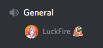

# Name Badges
Some nice custom badges for next to usernames. If you want your own custom one, please read https://github.com/LuckFire/NameBadges#badge-request.

## Previews




## Installation
For manual installation, go to  **your themes folder, open a command prompt / powershell / terminal / or git bash**  and enter the following:
```
git clone https://github.com/LuckFire/NameBadges
```
For quick installation, go to  **Settings -> Themes -> Quick CSS**  and copy-paste the following code:
```
@import url("https://raw.githack.com/LuckFire/NameBadges/main/source/badgesrc.css");
```

# Badge Request
If you want your ***VERY OWN*** name badge, make an issue request and I will add it as soon as I can. Note that you're only able to have one badge, so if at any time you want yours updated, make another issue request but add on "UPDATE REQUEST" or something similar that indicates that you want your badge updated. Images must be hosted on i.imgur, or cdn.discordapp.

**NOTE: IMAGES MUST BE THE SAME LENGTHxHEIGHT, OTHERWISE IT'S GOING TO BREAK/LOOK WEIRD**

## Credits 
Ty botato aka mr cute panda for helping me figure out how to get it to appear on at least 1 of the user modals <3
