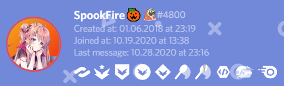
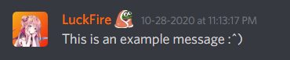

## Recent Changes (v1.1.0)
In order for better maintainability, I recoded this to be in SCSS instead of CSS. You may be asking "well, what's the difference!?!? do i still have my badge?!??!!" First off, there really isn't much of a difference besides it's easier for me to work with and is less of an eye sore. Secondly, yes you still have your badge. If you have name badges before this update, make sure you reinstall the theme completely to prevent any issues. If you're using the import, you have to install the theme as is because you cannot import an SCSS file. If your badge isn't appearing/appearing properly, make an issue request and ill look into it. 

# Discord Name Badges
Some nice custom badges for next to usernames. If you want your own custom one, please read https://github.com/Discord-Theme-Addons/discord-name-badges#badge-request.

# Previews



# Installation & Updating
For installation, go to **Themes -> Open a CMD / Powershell / Terminal / Gitbash** in the folder, and enter the following:
```
git clone https://github.com/Discord-Theme-Addons/discord-name-badges
```

Since Powercord's updater is currently broken, you have to update the theme manually. In order to do this, go to **Themes -> discord-name-badges -> Open a CMD / Powershell / Terminal / Gitbash** in the folder, and enter the following:
```
git pull
```

# Badge Request
I get it, you want your **VERY OWN** name badge, but you may be asking: "omG lcuKFiRE hoW do ig ET CooL nAMemBADGe?!?!", well.. the process is pretty simple actually. Make an issue request on this repo (https://github.com/Discord-Theme-Addons/discord-name-badges/issues/new), fill out the form given and I'll update it to give you your badge as soon as I can. Usually I'll close the issue request, so look out for that. Once I add your badge, make sure you update the theme so you can get it!

**NOTE: IMAGES MUST BE HOSTED ON A TRUSTED DOMAIN (such as i.imgur or cdn.discordapp) AND SHOULD BE THE SAME WIDTHxHEIGHT TO PREVENT IT FROM LOOKING WEIRD**

## Credits 
Ty botato aka mr cute panda for helping me figure out how to get it to appear on at least 1 of the user modals <3
