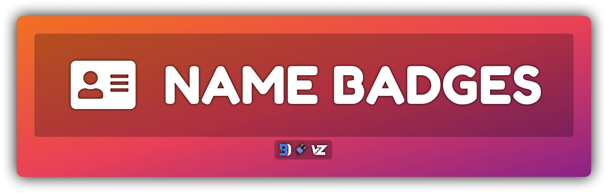
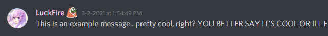

# Name badges
Some nice custom badges for next to usernames.
- If you'd like your own badges, please read the [badge request](https://github.com/Discord-Theme-Addons/discord-name-badges#badge-request) segment.



## Installation
For **[Powercord](http://powercord.dev/)** installation, **locate and head over to your themes folder, open a terminal of choice, and enter the following:**
```
git clone https://github.com/Discord-Theme-Addons/name-badges
```

For **[BetterDiscord](http://betterdiscord.app/)** installation, you will need **[DevilBro's Plugin Library](https://github.com/mwittrien/BetterDiscordAddons/tree/master/Library/)**. I do not recommend the use of this, as it can possibly cause performance issues due to it not being optimized that well. Proceed at your own risk.
- [Direct Download](https://github.com/Discord-Theme-Addons/name-badges/releases/download/1.4.0/NameBadges.theme.css)
- [View Source](https://discord-theme-addons.github.io/name-badges/src/betterdiscord/NameBadges.theme.css)

## Badge Request
To request your **VERY OWN** custom badge, make an **[issue](https://github.com/Discord-Theme-Addons/discord-name-badges/issues/new/choose)** using the "Request a Badge" template. Before submitting, please make sure you do the following:
- Images **MUST** be hosted on a trusted domain, such as imgur or discordapp itself. 
- They should be the same width by height, otherwise it may look weird.

If at any point in time you want your badge changed, please make another issue, however use the "Request Badge Change" template instead. As soon as I can, either Hoofer or I will add or update your badge. Usually, these are usually added in batches, so it may take some time as it is done manually. 
- Please DO NOT make a pull request adding your badge, as it's easier just for me to add them in a batch of users.

## Add it Yourself (POWERCORD ONLY)
If you don't want to wait for your badge to be added, you can add it yourself on your end. Only people who know what they're doing should proceed, as I won't offer any help for this.

1. Head over to `./src/badges/_users.scss`.
2. All the way at the bottom (inside of `$users:();`), make a new line and enter:
```scss
$users: (
    "YOUR_USER_ID" : "YOUR_BADGE_IMAGE"
);
```
3. Replace `YOUR_USER_ID` with your user id and replace `YOUR_BADGE_IMAGE` with the image url that is the badge that you'd like.

## Credits 
A big thank you to everyone who helped with this!
- **[botato](https://github.com/bototo2)** (aka the CUTEST panda in the world) for helping me learn more CSS to make badges appear on the user profile popout modal. 
- **[Hoofer](https://github.com/HooferDevelops)** for helping me maintain this as well as adding basic Vizality support.
- **[Snapperito](https://github.com/Snapperito)** for touching up the readme by fixing issues with the grammar.